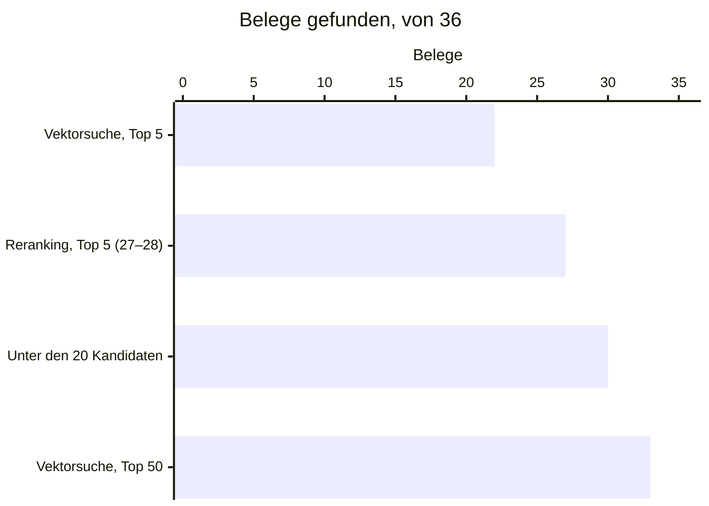
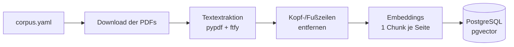
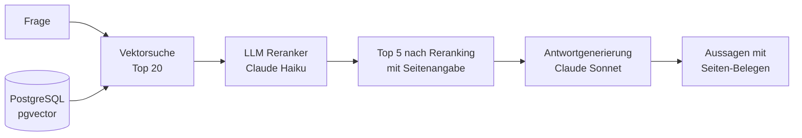

# Anlagen-Copilot

[](https://github.com/fknoerzer/anlagen-copilot/actions/workflows/ci.yml)

Ein RAG-System für technische Dokumentation aus der Antriebstechnik: Es beantwortet Fragen zu Getrieben, Motoren, Frequenzumrichtern und Schmierstoffen aus echten Herstellerhandbüchern, mit Quellenangabe bis auf die Seite. Das Projekt zeigt Retrieval über einen schwierigen deutschsprachigen Korpus, LLM-basiertes Reranking, Antworten, die jede Aussage auf eine Handbuchseite zurückführen oder ablehnen, und zwei Evaluationen, die messen, was jede Änderung tatsächlich bringt.

## Das Problem

Industriehandbücher sind ein schwerer Fall für Retrieval:

- **Die Seiten eines Handbuchs gleichen sich.** Hunderte Seiten mit demselben Vokabular, denselben Bauteilnamen, demselben Layout. Eine Vektorsuche findet zuverlässig das richtige *Thema*, aber nicht die Seite, auf der die *Antwort* steht.
- **Antworten stecken in Tabellen und Zeichnungen.** Schmierstoffmengen, Parameterlisten, Explosionszeichnungen mit Positionsnummern: Inhalte, die eine PDF-Textextraktion nur teilweise übersteht.
- **Manche Fragen brauchen zwei Dokumente.** Welches Öl in ein Getriebe gehört, steht in der Betriebsanleitung; welche Produkte dafür freigegeben sind, in der Schmierstofftabelle.

Der Korpus umfasst **6 Handbücher** von SEW-EURODRIVE und Siemens (SINAMICS G120C) mit zusammen 1.810 Seiten. Davon werden 1.334 Seiten eingelesen, 1.322 mit extrahierbarem Text landen im Index: Aus dem 572-seitigen Siemens-Listenhandbuch wird nur Kapitel 4 „Störungen und Warnungen" (S. 453–548) eingelesen, weil die Fragen der Instandhaltung dort ansetzen. Die übrigen Kapitel (rund 310 Seiten Parameterlisten, 135 Seiten Funktionspläne und der Anhang) sind bewusst ausgelassen.

## Ergebnisse

**Die Messfrage:** Landet die Seite, auf der die Antwort steht, unter den 5 Seiten, die an das Sprachmodell gehen? Was dort fehlt, kann keine Antwort zitieren.



Beim Reranking holt die Vektorsuche 20 Kandidaten, ein Sprachmodell (Claude Haiku 4.5) wählt daraus die besten 5. Es schöpft die 30 Belege unter den Kandidaten fast aus; die übrigen **6 kommen gar nicht erst unter die Kandidaten**. Der nächste Hebel liegt also vor dem Reranking, nicht darin. Am stärksten profitieren Fragen, die zwei Handbücher brauchen:

| Fragetyp | Nur Vektorsuche | Unter den 20 Kandidaten | Mit Reranking |
|---|---:|---:|---:|
| Zwei Handbücher (Multi-Hop) | 2 / 10 | 7 / 10 | 5–6 / 10 |
| Zeichnung | 7 / 8 | 8 / 8 | 7 / 8 |
| Nachschlagen | 7 / 10 | 8 / 10 | 8 / 10 |
| Tabelle | 6 / 8 | 7 / 8 | 7 / 8 |
| **Gesamt** | **22 / 36 (61 %)** | **30 / 36 (83 %)** | **27–28 / 36 (75–78 %)** |

**Antworten** (Claude Sonnet 5): Liegt ein Beleg im Prompt, zitiert die Antwort ihn in 86–92 % der Fälle. Von 5 Fragen, die die Handbücher nicht beantworten, lehnt das Modell 4–5 ab; von 31 beantwortbaren lehnt es 3 fälschlich ab.

Gemessen auf Eval-Set v3, Commit `a2454fd`; Spannen über drei Läufe, weil der Reranker nicht deterministisch ist. Läufe, Zählweise, ein Beispiel Schritt für Schritt und die Zahlen je Fragetyp für die Antworten stehen in [docs/messungen.md](docs/messungen.md).

| Kosten und Latenz | Nur Vektorsuche | Mit Reranking | Antwort dazu |
|---|---:|---:|---:|
| je Eval-Lauf (36 Fragen) | < 0,01 $ | ~0,60 $ | ~0,58 $ |
| je Frage (Median) | 0,2 s | 2,8–3,0 s | 3,3–3,8 s |

## Stand und Grenzen

- [x] Ingestion (naive Strategie: eine Seite = ein Chunk)
- [x] Vektorsuche, global und mit Begrenzung pro Dokument
- [x] LLM-Reranking
- [x] Retrieval-Evaluation mit protokollierten Läufen
- [x] Antwortgenerierung mit Seitenzitaten
- [ ] Evaluation der Antworten: Ablehnung und Belege gemessen; Prüfung der erwarteten Fakten folgt
- [ ] Layoutbewusste Ingestion-Strategie für Tabellen und Zeichnungen (Docling oder Azure Document Intelligence, noch offen)

### Bekannte Grenzen

Das Eval-Set ist klein: Eine Belegseite bewegt den Gesamtwert um knapp 3 Prozentpunkte, bei Multi-Hop um 10, und bei den fünf unbeantwortbaren Fragen zählt jede Frage 20 Prozentpunkte. Gemessen wird auf einem einzigen Korpus aus sechs Handbüchern zweier Hersteller. Die Textextraktion mit pypdf verliert die Spaltenstruktur von Tabellen, sodass sich Werte ihren Zeilen nicht mehr sicher zuordnen lassen. Die erwarteten Fakten der Antworten sind noch nicht geprüft.

## Architektur

### Ingestion



Die Handbücher werden anhand des Manifests `data/raw/corpus.yaml` von den Herstellerseiten geladen, seitenweise extrahiert und eingebettet. Zeilen, die auf mindestens 85 % der Seiten eines Dokuments wiederkehren (Kopf- und Fußzeilen), werden vorher entfernt, damit sie nicht jede Seite gleich aussehen lassen.

### Abfrage



- **Retrieval:** Die Vektorsuche holt 20 Kandidaten; optional begrenzt auf *n* Seiten pro Dokument.
- **Reranking:** Ein LLM liest Frage und Kandidaten gemeinsam und vergibt je Seite eine Relevanzstufe von 0 bis 3. Sortiert wird nach Stufe, innerhalb einer Stufe nach Vektor-Score.
- **Generierung:** Ein LLM antwortet nur aus den 5 Seiten, als Liste von Aussagen, von denen jede die Seiten nennt, aus denen sie stammt. Tragen die Seiten die Frage nicht, lehnt es ab, statt aus eigenem Wissen zu antworten. Ungültige Seitenangaben, eine Ablehnung mit Belegen oder eine Antwort ganz ohne Beleg lassen den Aufruf scheitern.

### Tech Stack

- **Sprache:** Python 3.12+
- **Package Manager:** [uv](https://docs.astral.sh/uv/)
- **Vektordatenbank:** PostgreSQL 16 mit [pgvector](https://github.com/pgvector/pgvector) (vollständige Suche mit Cosinus-Distanz, ohne ANN-Index)
- **Embeddings:** OpenAI `text-embedding-3-large` (1536 Dimensionen)
- **Reranking & Generierung:** Anthropic Claude, beide mit strukturierter Ausgabe (`output_config`): Reranking mit Claude Haiku 4.5, Generierung mit Claude Sonnet 5
- **PDF-Extraktion:** pypdf + ftfy (Reparatur fehlerhafter Zeichenkodierungen)
- **Validierung & Konfiguration:** Pydantic, pydantic-settings

## Designentscheidungen

Die wichtigsten Entscheidungen in einem Satz. Kontext, verworfene Alternativen und Konsequenzen stehen im jeweils verlinkten Architecture Decision Record; alle dreizehn ADRs listet [docs/adr/README.md](docs/adr/README.md).

- **Eine Seite = ein Chunk**, damit jede Quelle auf die PDF-Seite genau zitierbar ist. ([ADR 001](docs/adr/001-seite-als-chunk.md))
- **Reranker-Noten mit Seiten-ID, über strukturierte Ausgabe.** Ein Format ohne IDs sparte gut 70 % der Output-Tokens, senkte aber den Anteil gefundener Belegseiten von 67 % auf 58 % (v1). Seit die API das Schema der Noten durchsetzt, statt es nur zu beschreiben, bleiben die Belegseiten gleich (in allen drei Läufen 23 von 36 auf `b03d87b`, v2) bei 22 % weniger Output-Tokens. ([ADR 004](docs/adr/004-reranker-ausgabe.md), [ADR 012](docs/adr/012-strukturierte-ausgabe.md))
- **Kein stiller Rückfall auf die Reihenfolge der Vektorsuche**, damit kein Eval-Lauf ein Reranking protokolliert, das nicht stattgefunden hat. ([ADR 005](docs/adr/005-kein-stiller-rueckfall.md))
- **Vollständige Suche statt HNSW-Index**, weil der Index bei 5 Treffern für 3 von 36 Fragen zu wenige Seiten lieferte und bei 1.322 Seiten keine Zeit spart, sobald er zuverlässig sucht (gemessen auf `d60ddd5`). ([ADR 011](docs/adr/011-vollstaendige-suche-statt-hnsw.md))
- **Kein RAG-Framework**, damit sich jeder Schritt der Pipeline einzeln steuern, testen und messen lässt. ([ADR 010](docs/adr/010-kein-rag-framework.md))
- **Antworten als Aussagen mit Seiten-IDs**, statt Zitatmarken wie `[2]` im Fließtext, damit jede Aussage ihren Beleg trägt und kein Suchmuster Zitate aus dem Text lesen muss, wo Einheiten wie `[1/min]` ebenfalls in eckigen Klammern stehen. ([ADR 013](docs/adr/013-antworten-als-aussagen.md))

## Entwicklung mit Claude Code

Ziel des Projekts ist, die Mechanik eines RAG-Systems durch Eigenbau zu verstehen. Ingestion, Retrieval, Reranking und Evaluation sind daher von Hand geschrieben; die zugrunde liegenden Entscheidungen sind in den Docstrings begründet.

[Claude Code](https://claude.com/claude-code) kam als Pair Programmer für Reviews, Boilerplate, Testgerüste und Dokumentation zum Einsatz. Nicht für die Bewertung von Messergebnissen: Die Ground Truth des Eval-Sets ist manuell gegen die Quelldokumente verifiziert, Retrieval-Entscheidungen entstanden aus Handproben an Einzelfragen.

Diese Arbeitsteilung ist nicht nur beschrieben, sondern im Werkzeug verankert. Die Regeln stehen in `CLAUDE.md`, die Commit-Konventionen als aufrufbarer Befehl in `.claude/commands/`, und in `.claude/skills/` liegen die Konventionen für Auswertung, Tests und Prompt-Änderungen. Ein PreToolUse-Hook in `.claude/settings.json` lehnt Schreibzugriffe der Editierwerkzeuge auf `src/**` ab. Freigeschaltet wird er nur für einen einzelnen Auftrag: Beginnt der Prompt des Autors oder eine seiner Zeilen mit `delegiere:`, legt ein weiterer Hook eine Freigabedatei an, die ein Stop-Hook am Ende der Antwort wieder löscht. Schreibvorgänge über die Shell deckt der Hook nicht ab: Er sichert gegen Abdriften im Alltag, nicht gegen einen entschlossenen Umweg.

## Codequalität

- **Über 120 automatisierte Tests** (`uv run pytest`), ohne echte API-Calls: Die OpenAI- und Anthropic-Clients werden durch Fakes ersetzt. Integrationstests gegen PostgreSQL laufen, wenn die Datenbank verfügbar ist.
- **Ohne Keys und ohne Docker prüfbar:** `uv sync --dev && uv run pytest` läuft in etwa 16 Sekunden durch. Die Tests setzen eigene Platzhalter-Keys und lesen keine `.env`; ohne Datenbank werden nur die Integrationstests übersprungen.
- **Statische Typprüfung** mit mypy, **Linting & Formatierung** mit Ruff, **Abhängigkeitsprüfung** mit deptry.
- **Pre-commit-Hooks** für Ruff, mypy und deptry.
- **CI-Pipeline** (GitHub Actions) mit pgvector-Service-Container: Ruff, mypy, deptry und die komplette Testsuite inklusive Datenbanktests bei jedem Push.

Die einzelnen Befehle stehen in [docs/setup.md](docs/setup.md#entwicklungsbefehle).

## Schnellstart

Nur prüfen, ohne Keys und ohne Docker: `uv sync --dev && uv run pytest` läuft in etwa 16 Sekunden durch (siehe [Codequalität](#codequalität)).

Für einen echten Lauf: Python 3.12, [uv](https://docs.astral.sh/uv/), Docker sowie API-Keys für OpenAI und Anthropic.

```bash
git clone https://github.com/fknoerzer/anlagen-copilot.git
cd anlagen-copilot
uv sync --dev
cp .env.example .env   # OPENAI_API_KEY und ANTHROPIC_API_KEY eintragen
docker compose up -d
uv run python -m anlagen_copilot.scripts.init_db
uv run anlagen-copilot   # Handbücher laden und indexieren

uv run python -m anlagen_copilot.scripts.eval_retrieval --k 5 --candidates 20 --reranker claude-haiku-4-5-20251001
uv run python -m anlagen_copilot.scripts.eval_generate --k 5 --candidates 20 --reranker claude-haiku-4-5-20251001
```

Die ausführliche Fassung mit Erklärungen zu jedem Schritt steht in [docs/setup.md](docs/setup.md); alle Optionen der Eval-Skripte zeigt `--help`.

## Lizenz

[MIT](LICENSE)
