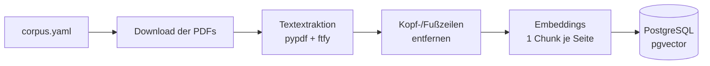
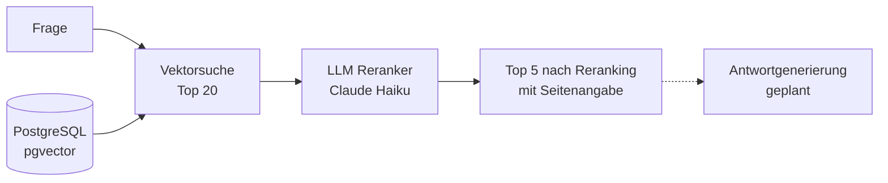

# Anlagen-Copilot

[](https://github.com/fknoerzer/anlagen-copilot/actions/workflows/ci.yml)

Ein RAG-System für technische Dokumentation aus der Antriebstechnik: Es beantwortet Fragen zu Getrieben, Motoren, Frequenzumrichtern und Schmierstoffen aus echten Herstellerhandbüchern, mit Quellenangabe bis auf die Seite. Das Projekt zeigt Retrieval über einen schwierigen deutschsprachigen Korpus, LLM-basiertes Reranking mit strukturierter Ausgabe und eine Evaluation, die misst, was jede Änderung am Retrieval tatsächlich bringt.

## Das Problem

Industriehandbücher sind ein schwerer Fall für Retrieval:

- **Die Seiten eines Handbuchs gleichen sich.** Hunderte Seiten mit demselben Vokabular, denselben Bauteilnamen, demselben Layout. Eine Vektorsuche findet zuverlässig das richtige *Thema*, aber nicht die Seite, auf der die *Antwort* steht.
- **Antworten stecken in Tabellen und Zeichnungen.** Schmierstoffmengen, Parameterlisten, Explosionszeichnungen mit Positionsnummern: Inhalte, die eine PDF-Textextraktion nur teilweise übersteht.
- **Manche Fragen brauchen zwei Dokumente.** Welches Öl in ein Getriebe gehört, steht in der Betriebsanleitung; welche Produkte dafür freigegeben sind, in der Schmierstofftabelle.

Der Korpus umfasst **6 Handbücher** von SEW-EURODRIVE und Siemens (SINAMICS G120C) mit zusammen 1.810 Seiten. Davon werden 1.334 Seiten eingelesen, 1.322 mit extrahierbarem Text landen im Index: Aus dem 572-seitigen Siemens-Listenhandbuch wird nur Kapitel 4 „Störungen und Warnungen" (S. 453–548) eingelesen, weil die Fragen der Instandhaltung dort ansetzen. Die übrigen Kapitel (rund 310 Seiten Parameterlisten, 135 Seiten Funktionspläne und der Anhang) sind bewusst ausgelassen.

## Ergebnisse

**Die Messfrage:** Landet die Seite, auf der die Antwort steht, unter den 5 Seiten, die an das Sprachmodell gehen? Was dort fehlt, kann keine Antwort zitieren.

Gemessen an 36 Belegseiten aus den 31 beantwortbaren Fragen des Eval-Sets. Die 5 Multi-Hop-Fragen brauchen je zwei Seiten; die 5 unbeantwortbaren Fragen haben keine Belegseite und zählen hier nicht mit.

Am stärksten profitieren Fragen, die zwei Handbücher brauchen:

| Fragetyp | Nur Vektorsuche | Mit Reranking |
|---|---:|---:|
| Zwei Handbücher (Multi-Hop) | 2–3 / 10 | 5–6 / 10 |
| Zeichnung | 6 / 8 | 7 / 8 |
| Nachschlagen | 6–7 / 10 | 8 / 10 |
| Tabelle | 3–4 / 8 | 3–4 / 8 |
| **Gesamt** | **18–19 / 36 (50–53 %)** | **24–25 / 36 (67–69 %)** |

Beim Reranking holt die Vektorsuche zunächst 20 Kandidaten, ein Sprachmodell (Claude Haiku 4.5) wählt daraus die besten 5.

Beide Spalten sind Spannen über wiederholte Läufe mit gleichen Parametern: die Vektorsuche über zwei Läufe (Commits `9db58dc` und `6e766d3` in `data/eval_runs.jsonl`), das Reranking über drei mit demselben Bewertungsformat (`aab6042`, `4d187b6`, `1f4d839`). Die Läufe liegen auf verschiedenen Commits, deren Änderungen Retrieval und Reranking nicht berührten. Die Streuung der Reranking-Spalte kommt von der Generierung des Rerankers, die nicht deterministisch ist; die 20 Kandidaten davor holt die Vektorsuche nach heutigem Plan der Datenbank ohne Index, also vollständig. Die Spalte „Nur Vektorsuche“ lief über den HNSW-Index von pgvector, der approximativ sucht und bei einzelnen Fragen weniger als fünf Seiten lieferte. Die Suche läuft inzwischen vollständig und ist damit reproduzierbar ([ADR 011](docs/adr/011-vollstaendige-suche-statt-hnsw.md)). Die Spannen je Kategorie stammen aus verschiedenen Läufen und summieren sich deshalb nicht direkt auf die Gesamtspanne.

Bei Tabellen liegen beide Spannen gleich: dort ist **keine Verbesserung messbar**, der Unterschied bleibt innerhalb der Streuung der Vektorsuche.

Der Reranker kann nur Seiten auswählen, die unter den 20 Kandidaten stehen. Dort sind 24–26 der 36 Belegseiten dabei (67–72 %, gemessen in denselben zwei Läufen der Vektorsuche wie oben). Das ist also das Maximum, und mit 24–25 Seiten schöpft der Reranker es fast aus. Von den 11–12 Seiten, die am Ende fehlen, sind **mindestens 10 gar nicht erst unter den Kandidaten**. Bei Tabellen etwa sind dort nur 4–5 von 8 Belegseiten dabei.

### Was das Reranking kostet

| | Nur Vektorsuche | Mit Reranking |
|---|---:|---:|
| Input-Tokens je Frage | — | ~15.600 |
| Output-Tokens je Frage | — | ~320 |
| Kosten je Eval-Lauf (alle 36 Fragen) | < 0,01 $ | ~0,62 $ |

Grundlage sind die je Lauf protokollierten Tokenzahlen (560.094 Input, 11.620 Output bei 20 Kandidaten) und der Listenpreis von Claude Haiku 4.5: 1 $ je Mio. Input-, 5 $ je Mio. Output-Tokens. Eine Latenzangabe fehlt, weil die zugrunde liegenden Läufe keine Zeiten enthalten; der Eval-Lauf erfasst sie je Frage, getrennt nach Suche und Reranking.

Das Reranking ist der teuerste Schritt der Pipeline: Statt eines Embedding-Aufrufs gehen 20 vollständige Handbuchseiten an ein Sprachmodell. Bei Nachschlagefragen, die schon ohne Reranking bei 60–70 % liegen, steht dieser Aufwand in einem schlechteren Verhältnis zum Ertrag als bei Multi-Hop-Fragen. Die Entscheidung könnte künftig je Fragetyp fallen statt pauschal.

**Ein Beispiel aus dem Eval-Set** (Frage `q-008`, zwei Handbücher):

> Der Umrichter meldet die Störung F07011 "Motor Übertemperatur". Welche Reaktion löst das am Umrichter aus, und was sollte laut der Motor-Betriebsanleitung zusätzlich geprüft werden, wenn sich der Motor zu stark erwärmt?

Ein typischer Fall aus der Instandhaltung: Die Störmeldung kommt vom Siemens-Umrichter, die Prüfschritte stehen in der Anleitung des SEW-Motors. Die Antwort braucht deshalb zwei Seiten aus zwei Handbüchern:

| Beleg | Was dort steht |
|---|---|
| SINAMICS G120C Listenhandbuch, S. 501 | F07011 löst die Reaktion AUS2 aus; Ursachen: Überlastung, zu hohe Umgebungstemperatur, Sensorfehler |
| SEW Motoren-Betriebsanleitung DRN, S. 261 | „Motor erwärmt sich zu stark": Kühlluft, Luftfilter und Umgebungstemperatur prüfen, ggf. Fremdlüfter nachrüsten |

| | Belegseiten unter den Top 5 |
|---|---:|
| Nur Vektorsuche | 0 / 2 |
| Mit Reranking (20 Kandidaten, drei Läufe) | 1 / 2 |
| Mit Reranking (50 Kandidaten, ein Lauf) | 2 / 2 |

Das Beispiel zeigt beide Seiten des Rerankings: Aus 20 Kandidaten holt es die eine Seite nach vorne, die dort überhaupt vorkommt. Mehr ist nicht möglich, denn die zweite Seite steht gar nicht erst unter den Top 20. Erst mit 50 Kandidaten sind beide Belege dabei. Die Grenze liegt hier also nicht beim Reranker, sondern bei der Vektorsuche davor.

**Was daraus folgt:** Das verbleibende Problem ist nicht mehr die Reihenfolge innerhalb der 20 Kandidaten, sondern was gar nicht erst hineinkommt. Bei Tabellen liegt das an der Extraktion: Selbst unter den Top 20 tauchen nur 4–5 von 8 auf, und entsprechend bringt das Reranking dort nichts. Bei Multi-Hop-Fragen wie q-008 liegt es an der Vektorsuche selbst. Mehr Kandidaten helfen dort im Einzelfall, insgesamt aber nicht (30 Kandidaten: 67 %, 50: 69 %), und sie kosten proportional mehr Tokens. Der nächste Hebel für Tabellen ist deshalb eine layoutbewusste Ingestion (siehe Roadmap).

## Tech Stack

- **Sprache:** Python 3.12+
- **Package Manager:** [uv](https://docs.astral.sh/uv/)
- **Vektordatenbank:** PostgreSQL 16 mit [pgvector](https://github.com/pgvector/pgvector) (vollständige Suche mit Cosinus-Distanz, ohne ANN-Index)
- **Embeddings:** OpenAI `text-embedding-3-large` (1536 Dimensionen)
- **Reranking & Generierung:** Anthropic Claude (Tool Use für strukturierte Ausgabe; Generierung geplant)
- **PDF-Extraktion:** pypdf + ftfy (Reparatur fehlerhafter Zeichenkodierungen)
- **Validierung & Konfiguration:** Pydantic, pydantic-settings

## Architektur

### Ingestion



Die Handbücher werden anhand des Manifests `data/raw/corpus.yaml` von den Herstellerseiten geladen, seitenweise extrahiert und eingebettet. Zeilen, die auf mindestens 85 % der Seiten eines Dokuments wiederkehren (Kopf- und Fußzeilen), werden vorher entfernt, damit sie nicht jede Seite gleich aussehen lassen.

### Abfrage



- **Retrieval:** Die Vektorsuche holt 20 Kandidaten; optional begrenzt auf *n* Seiten pro Dokument.
- **Reranking:** Ein LLM liest Frage und Kandidaten gemeinsam und vergibt je Seite eine Relevanzstufe von 0 bis 3. Sortiert wird nach Stufe, innerhalb einer Stufe nach Vektor-Score.

## Designentscheidungen

Die wichtigsten Entscheidungen in einem Satz. Kontext, verworfene Alternativen und Konsequenzen stehen jeweils im verlinkten [Architecture Decision Record](docs/adr/).

- **Eine Seite = ein Chunk**, damit jede Quelle auf die PDF-Seite genau zitierbar ist. ([ADR 001](docs/adr/001-seite-als-chunk.md))
- **Chunking-Strategie als Spalte in derselben Tabelle**, damit naive und layoutbewusste Strategie mit einem Parameter vergleichbar sind. ([ADR 002](docs/adr/002-strategie-als-spalte.md))
- **1536 statt 3072 Embedding-Dimensionen**, weil der HNSW-Index von pgvector höchstens 2000 zulässt; die Grenze bleibt, damit der Index ohne neue Embeddings zurückkommen kann. ([ADR 003](docs/adr/003-embedding-dimensionen.md))
- **Reranker-Noten mit Seiten-ID.** Ein Format ohne IDs sparte gut 70 % der Output-Tokens, senkte aber den Anteil gefundener Belegseiten von 67 % auf 58 % (v1). ([ADR 004](docs/adr/004-reranker-ausgabe.md))
- **Kein stiller Rückfall auf die Reihenfolge der Vektorsuche**, damit kein Eval-Lauf ein Reranking protokolliert, das nicht stattgefunden hat. ([ADR 005](docs/adr/005-kein-stiller-rueckfall.md))
- **Eine Transaktion pro Dokument**, damit ein abgebrochener Lauf kein Dokument leer oder halb geschrieben zurücklässt. ([ADR 006](docs/adr/006-transaktion-pro-dokument.md))
- **Embedding-Konfiguration vor dem ersten Download prüfen**, damit ein falscher Key oder eine falsche Dimension den Lauf nach einer Sekunde beendet. ([ADR 007](docs/adr/007-konfiguration-vorab-pruefen.md))
- **Jeder Eval-Lauf wird mit seiner Konfiguration protokolliert**, damit sich jede Zahl in dieser README auf einen Lauf zurückführen lässt. ([ADR 008](docs/adr/008-eval-laeufe-protokollieren.md))
- **PostgreSQL mit pgvector als Vektordatenbank**, damit Vektorsuche, Constraints und die Transaktion pro Dokument in einem System liegen. ([ADR 009](docs/adr/009-pgvector.md))
- **Kein RAG-Framework**, damit sich jeder Schritt der Pipeline einzeln steuern, testen und messen lässt. ([ADR 010](docs/adr/010-kein-rag-framework.md))
- **Vollständige Suche statt HNSW-Index**, weil der Index bei 5 Treffern für 3 von 36 Fragen zu wenige Seiten lieferte und bei 1.322 Seiten keine Zeit spart, sobald er zuverlässig sucht (gemessen auf `2ac65fd`). ([ADR 011](docs/adr/011-vollstaendige-suche-statt-hnsw.md))
- **Strukturierte Ausgabe statt erzwungenem Tool-Call**, damit die API das Schema der Noten durchsetzt, statt es nur zu beschreiben. Die Messung gegen den bisherigen Weg steht noch aus. ([ADR 012](docs/adr/012-strukturierte-ausgabe.md))

## Entwicklung mit Claude Code

Ziel des Projekts ist, die Mechanik eines RAG-Systems durch Eigenbau zu verstehen. Ingestion, Retrieval, Reranking und Evaluation sind daher von Hand geschrieben; die zugrunde liegenden Entscheidungen sind in den Docstrings begründet.

[Claude Code](https://claude.com/claude-code) kam als Pair Programmer für Reviews, Boilerplate, Testgerüste und Dokumentation zum Einsatz. Nicht für die Bewertung von Messergebnissen: Die Ground Truth des Eval-Sets ist manuell gegen die Quelldokumente verifiziert, Retrieval-Entscheidungen entstanden aus Handproben an Einzelfragen.

Diese Arbeitsteilung ist nicht nur beschrieben, sondern im Werkzeug verankert. Die Regeln stehen in `CLAUDE.md`, die Commit-Konventionen als aufrufbarer Befehl in `.claude/commands/`, und in `.claude/skills/` liegen die Konventionen für Auswertung, Tests und Prompt-Änderungen. Ein PreToolUse-Hook in `.claude/settings.json` lehnt Schreibzugriffe der Editierwerkzeuge auf `src/**` ab. Freigeschaltet wird er nur für einen einzelnen Auftrag: Beginnt der Prompt des Autors mit `delegiere:`, legt ein weiterer Hook eine Freigabedatei an, die ein Stop-Hook am Ende der Antwort wieder löscht. Schreibvorgänge über die Shell deckt der Hook nicht ab: Er sichert gegen Abdriften im Alltag, nicht gegen einen entschlossenen Umweg.

## Evaluation & Qualitätssicherung

- **Eval-Set** (`data/eval_set.yaml`): 36 Fragen in fünf Kategorien (jeder Lauf stellt alle 36): Nachschlagen (10), Tabelle (8), Zeichnung (8), Zwei Handbücher (Multi-Hop, 5) und Unbeantwortbar (5). Jede Frage nennt die Seiten, die eine korrekte Antwort zitieren muss, und die Fakten, die sie enthalten muss. Die unbeantwortbaren Fragen prüfen später, ob die Generierung ablehnt, statt zu halluzinieren.
- **Über 80 automatisierte Tests** (`uv run pytest`), ohne echte API-Calls: Die OpenAI- und Anthropic-Clients werden durch Fakes ersetzt. Integrationstests gegen PostgreSQL laufen, wenn die Datenbank verfügbar ist.
- **Statische Typprüfung** mit mypy, **Linting & Formatierung** mit Ruff, **Abhängigkeitsprüfung** mit deptry.
- **Pre-commit-Hooks** für Ruff, mypy und deptry.
- **CI-Pipeline** (GitHub Actions) mit pgvector-Service-Container: Ruff, mypy, deptry und die komplette Testsuite inklusive Datenbanktests bei jedem Push.

## Stand & Roadmap

- [x] Ingestion (naive Strategie: eine Seite = ein Chunk)
- [x] Vektorsuche, global und mit Begrenzung pro Dokument
- [x] LLM-Reranking
- [x] Retrieval-Evaluation mit protokollierten Läufen
- [ ] Antwortgenerierung mit Seitenzitaten
- [ ] Evaluation der Antworten (erwartete Fakten, Ablehnung bei unbeantwortbaren Fragen)
- [ ] Layoutbewusste Ingestion-Strategie für Tabellen und Zeichnungen (Docling oder Azure Document Intelligence, noch offen)

## Voraussetzungen

- Python 3.12 und [uv](https://docs.astral.sh/uv/)
- Docker (für PostgreSQL mit pgvector)
- API-Keys für OpenAI (Embeddings) und Anthropic (Reranking)

## Installation & Start

### 1. Repository klonen

```bash
git clone https://github.com/fknoerzer/anlagen-copilot.git
cd anlagen-copilot
```

### 2. Abhängigkeiten installieren und konfigurieren

```bash
uv sync --dev
cp .env.example .env   # OPENAI_API_KEY und ANTHROPIC_API_KEY eintragen
```

### 3. Datenbank starten und Schema anlegen

```bash
docker compose up -d
uv run python -m anlagen_copilot.scripts.init_db
```

### 4. Korpus laden und indexieren

```bash
uv run anlagen-copilot
```

Die PDFs liegen aus urheberrechtlichen Gründen nicht im Repository. Sie werden beim ersten Lauf anhand der URLs in `data/raw/corpus.yaml` von den Herstellerseiten geladen. Das Manifest hält zu jedem Dokument Titel, Hersteller, Ausgabe, Bezugsdatum und Quelle fest, damit nachvollziehbar bleibt, auf welcher Dokumentversion die Messwerte beruhen.

### 5. Retrieval evaluieren

```bash
# Nur Vektorsuche
uv run python -m anlagen_copilot.scripts.eval_retrieval --k 5

# Mit Reranking: 20 Kandidaten holen, auf 5 eindampfen
uv run python -m anlagen_copilot.scripts.eval_retrieval --k 5 --candidates 20 --reranker claude-haiku-4-5
```

Jeder Lauf hängt eine Zeile an `data/eval_runs.jsonl` an.

## Entwicklungsbefehle

```bash
uv run pre-commit install
uv run ruff check .
uv run ruff format .
uv run mypy src
uv run pytest --cov=src
```

## Lizenz

[MIT](LICENSE)
